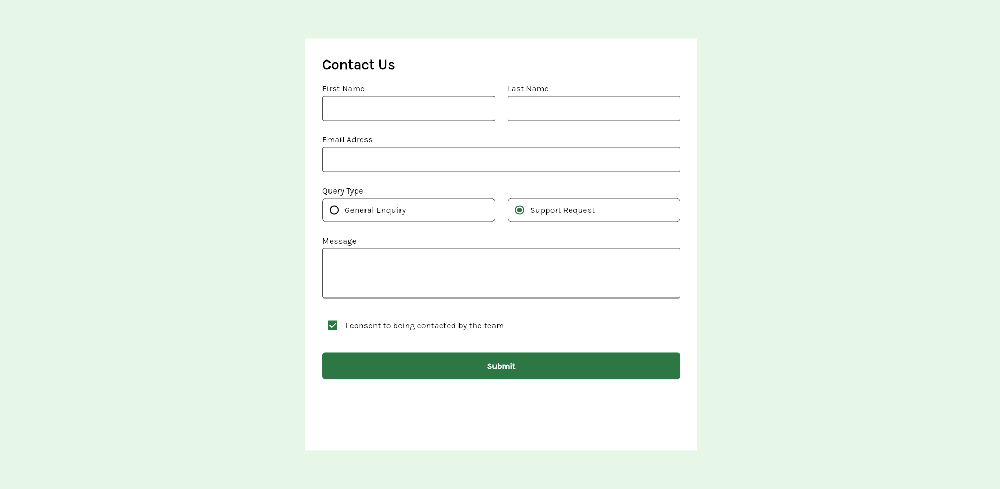
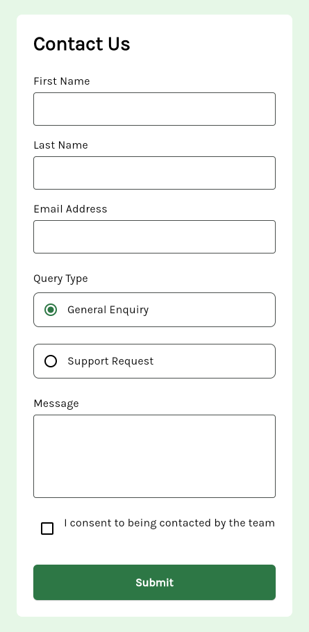

# Frontend Mentor - Contact Form Solution

Este projeto é uma solução para o desafio [Contact form](https://www.frontendmentor.io/challenges/contact-form--G-hYlqKJj) do Frontend Mentor. O objetivo foi desenvolver um formulário funcional, acessível e responsivo, seguindo boas práticas de desenvolvimento com Flutter Web e Dart.

## Tabela de Conteúdos

- [Visão Geral](#visão-geral)
  - [O Desafio](#o-desafio)
  - [Screenshot](#screenshot)
  - [Links](#links)
- [Processo de Desenvolvimento](#processo-de-desenvolvimento)
  - [Tecnologias Utilizadas](#tecnologias-utilizadas)
  - [O que Aprendi](#o-que-aprendi)
  - [Desenvolvimento Contínuo](#desenvolvimento-contínuo)
  - [Recursos Úteis](#recursos-úteis)
- [Autora](#autora)

## Visão Geral

### O Desafio

Usuários devem ser capazes de:

- Preencher o formulário e ver uma mensagem de sucesso (toast) ao enviar corretamente
- Ver mensagens de erro se:
  - Um campo obrigatório for deixado em branco
  - O e-mail estiver em formato inválido
- Preencher o formulário usando apenas o teclado
- Receber feedback acessível (leitores de tela)
- Ver o layout adaptado para diferentes tamanhos de tela
- Ver estados de foco e hover nos elementos interativos

### Screenshot

  
  

### Links

- [Repositório no GitHub](https://github.com/JennieOliveira99/FrontEndMentor)
- [Live site (em breve)](https://your-live-site-url.com)

## Processo de Desenvolvimento

### Tecnologias Utilizadas

- Flutter Web
- Dart
- Temas personalizados (Custom Theme)
- Widgets reutilizáveis
- Boas práticas para evitar código repetido
- Formulários com validação
- Fontes externas importadas (custom fonts)
- Responsividade

### O que Aprendi

### 🧱 Fundamentos de Layout
 - Scaffold
 - Padding, EdgeInsets, SizedBox
 - Column e Row
 - Expanded
 - Container com BoxDecoration
 - Align, CrossAxisAlignment, MainAxisAlignment
 - ConstrainedBox

### 🧑‍💻 Widgets de Entrada
- TextField
- TextFormField
- Checkbox
- Radio
- Form (estrutura para validação)

### 🎨 Estilização
- OutlineInputBorder
- Border.all, BorderRadius.circular
- Cores personalizadas com Color e Theme
- BoxDecoration

### 🧩 Componentes Personalizados
- CustomElevatedButton (botão criado por você)
- CustomTitleText (provavelmente um wrapper para Text)
- CustomTheme (tema personalizado com ThemeData)

### 📱 Responsividade
- MediaQuery.of(context).size.width (para detectar se é mobile)
- LayoutBuilder (não obrigatório, mas recomendado em ajustes locais)
- Lógica condicional isMobile ? WidgetA : WidgetB
- Separação entre FormPageDesktop e FormPageMobile
- SingleChildScrollView para evitar overflow no mobile

### 🚀 Boas Práticas
- Separação de responsabilidades em arquivos
- Organização de pastas
- Uso de StatelessWidget e StatefulWidget
- Lógica de setState para atualizar estado de Radio e Checkbox

### Desenvolvimento Contínuo

Próximas etapas:

- Integração com Firebase
- Toasts de sucesso
- Mensagens de erro dinâmicas nos formulários
- Melhorias na acessibilidade
- Animações suaves nas interações

### Recursos Úteis

- [Documentação oficial do Flutter](https://docs.flutter.dev/)
- [Google Fonts para Flutter](https://pub.dev/packages/google_fonts)
- [Material Design guidelines](https://m3.material.io/)

## Autora

- Nome: **Jennyfer Alvim de Oliveira**
- GitHub: [JennieOliveira99](https://github.com/JennieOliveira99)
- Frontend Mentor: [@JennieOliveira99](https://www.frontendmentor.io/profile/JennieOliveira99)